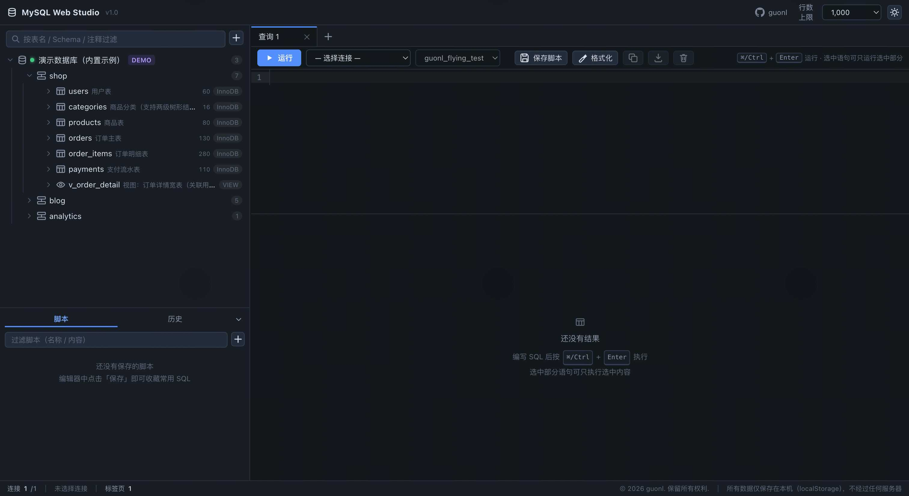
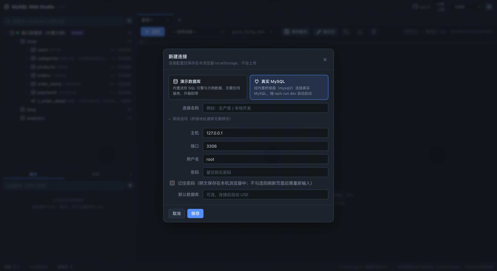
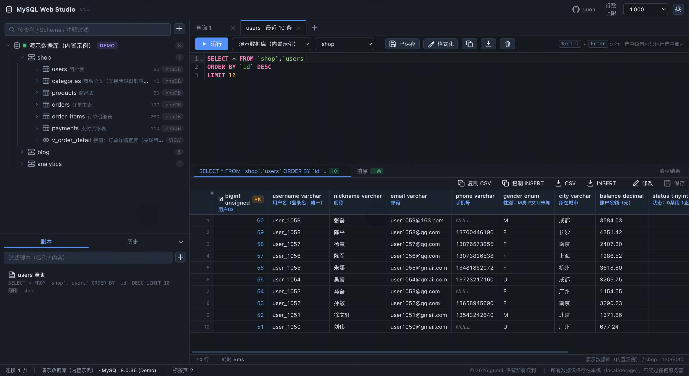
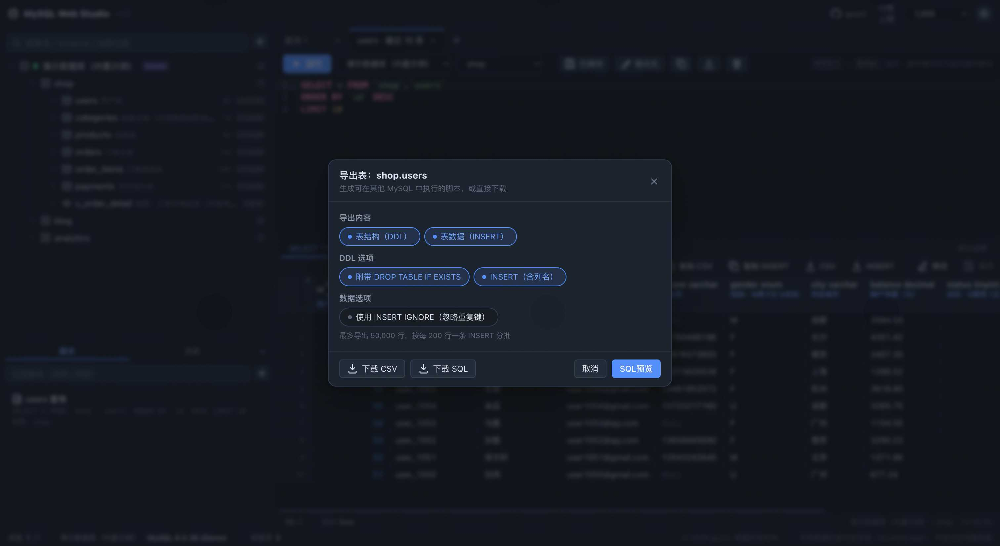
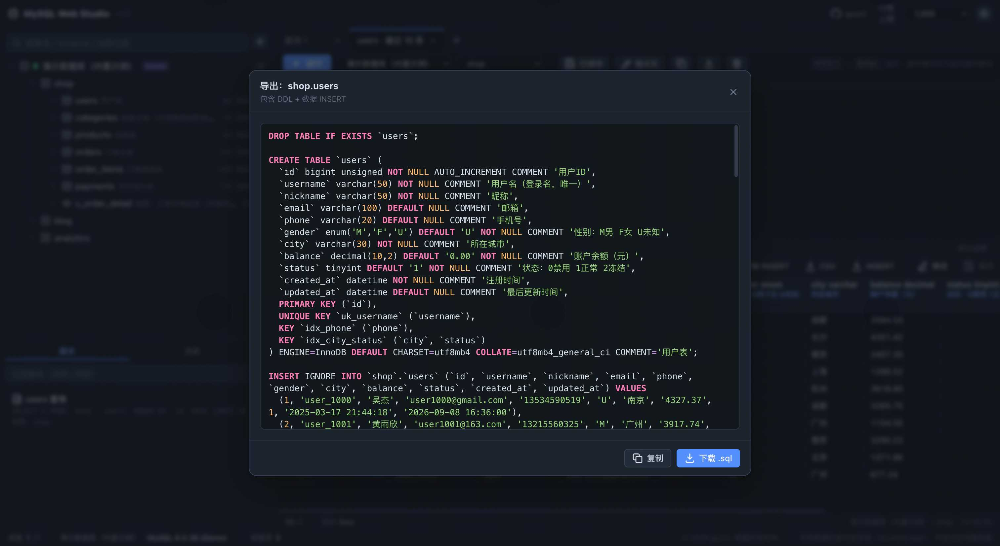
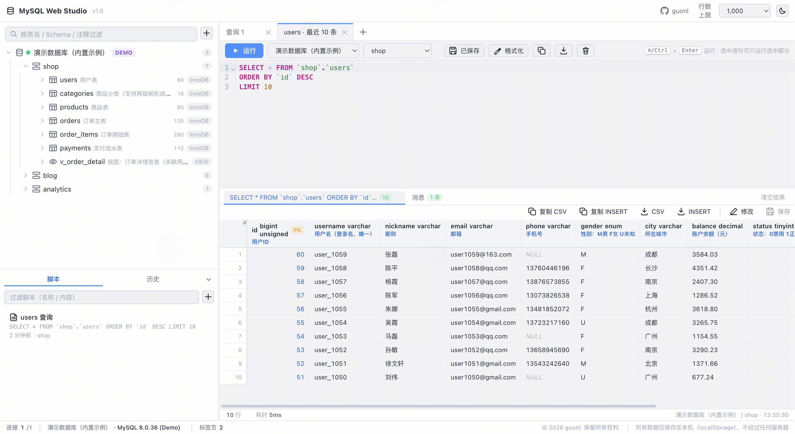
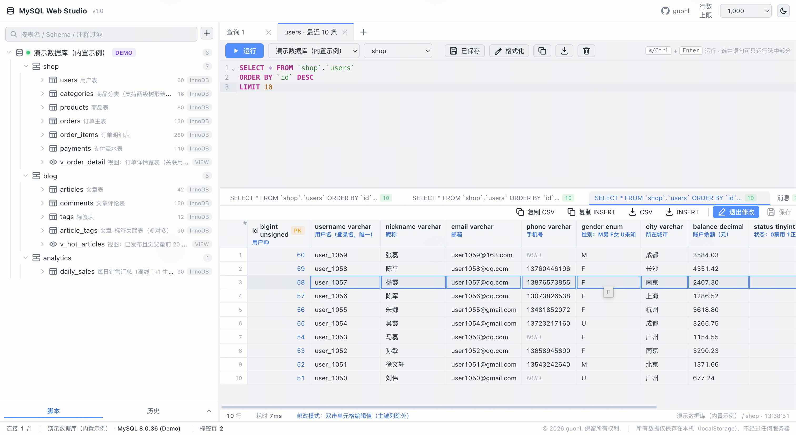
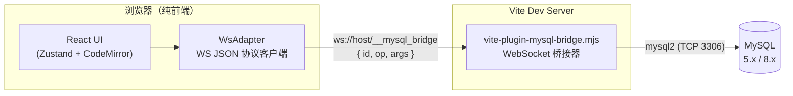

# MySQL Web Studio

纯前端的 MySQL 客户端 —— 在浏览器中管理连接、浏览库表、执行 SQL、导出数据，体验对标桌面客户端（如 Navicat / DataGrip 的核心常用功能）。支持 **Web 方式** 直接使用，也可 **打包为 Chrome 插件（MV3）** 安装到浏览器。

**内置演示库**：项目自带一个完全离线的示例服务器（3 个 Schema、11 张表 + 2 个视图，纯前端迷你 SQL 引擎模拟），克隆下来打开页面即可体验，无需任何 MySQL 环境。

> **一句话理解**：界面是纯前端 SPA；因为浏览器安全模型不允许网页直连 TCP，本项目在 Vite dev server 中内嵌了一个 **WebSocket 桥接器**（基于 `mysql2`），由它代理浏览器与 MySQL 之间的通信。整个方案只需一条命令启动，无需独立后端服务。

## 功能特性

- **连接管理**：支持添加多个 MySQL 连接，自定义命名；密码可选「记住」；桥接地址零配置（留空自动使用内置桥接器）
- **库表浏览**：连接 → Schema → 表/视图 三级树；行数与表注释一目了然；右键菜单（复制名称、查看 DDL、最近记录、前 100 行、导出等）
- **Schema 手风琴交互**：同一连接同时只展开/高亮一个 Schema（当前项加粗高亮，其余自动折叠），**表名/注释过滤只作用于当前展开的 Schema**——多库同名表不会被一并带出
- **SQL 编辑与执行**：CodeMirror 6 编辑器，SQL 语法高亮与补全（含字段 COMMENT 提示）；多查询标签页；支持只运行选中语句；一键「美化」（按分号切分多语句逐条格式化）；查询类语句未写 `LIMIT` 时自动按右上角行数上限附加，防止误拉全表
- **结果展示**：表头显示字段名、类型、主键徽标与 **COMMENT 描述**；长字段（JSON/TEXT）自动截断为前 100 字符，悬停查看完整值、双击复制完整值，不再被超宽字段撑坏表格；行数与耗时固定底部；结果页签右键集成复制/下载（CSV、INSERT）与批量关闭；单元格右键可复制值或生成 INSERT / UPDATE 语句；消息页签汇总每次执行状态
- **SQL 脚本**：保存 / 更新 / 重命名脚本（localStorage 本地持久化），随时从左下角「脚本」面板打开
- **执行历史**：自动记录最近执行的 SQL，可回填重跑
- **导出**：
  - 表右键「导出 SQL」：可选 DDL / 数据 INSERT，支持 `DROP TABLE`、`IF NOT EXISTS`、`INSERT IGNORE`，可「SQL预览」（语法高亮 + 复制/下载，预览叠加在导出弹窗上层、关闭后可继续调整选项）或直接「下载 SQL」
  - 表数据 / 查询结果导出 CSV
- **界面体验**：9 套主流主题配色（暗色：默认 / One Dark Pro / Dracula / Tokyo Night / Monokai / Nord；亮色：默认 / GitHub Light / Solarized Light），顶栏调色板按钮弹出带色卡预览的主题菜单，选择即生效并持久化、刷新无闪烁；侧边栏可**整体收起为窄条**（点击还原原宽度）；DDL/SQL 弹窗支持**拖拽调整大小**，弹窗可相互叠加（如导出弹窗上叠 SQL 预览）；结果区高度可拖拽；已禁用触控板双指左右滑的前进/后退手势，避免误触导航导致连接中断
- **双形态**：Web 模式开箱即用；`npm run build:ext` 可打包为 Chrome 插件（MV3），数据存 `chrome.storage.local`

## 产品截图















## 快速开始

```bash
# 环境要求：Node.js >= 18
npm install
npm run dev
```

打开终端提示的地址（默认 <http://localhost:5188>），点击左上角「+ 新建连接」，填入 MySQL 主机、端口、用户名、密码即可。

桥接器已内嵌在 dev server 中，随 `npm run dev` 自动启动，**无需额外配置**。

#### 常驻后台运行（dev.sh）

不想占着一个前台终端？项目根目录提供 [dev.sh](dev.sh) 服务控制脚本：

```bash
chmod +x dev.sh       # 首次使用加执行权限

./dev.sh start        # 后台启动（日志写入 dev.log，启动后自动健康检查）
./dev.sh status       # 查看运行状态（进程 / 端口 / HTTP 响应）
./dev.sh log          # 实时查看日志
./dev.sh restart      # 重启
./dev.sh stop         # 停止

# 直接前台调试仍用 npm run dev
```

> 脚本内部使用 `nohup ... < /dev/null &` 启动，规避了裸 `&` 后台运行时 Vite 读终端 stdin 被内核 SIGTTIN 挂起、服务"看似启动成功却无法访问"的坑。

### Chrome 插件方式

```bash
npm run build:ext   # 构建插件产物到 dist/（静态前端 + manifest.json + sw.js）
npm run bridge      # 另开终端，启动独立桥接器（默认端口 5189）
```

Chrome 打开 `chrome://extensions` → 开启「**开发者模式**」→「**加载已解压的扩展程序**」→ 选择 `dist/` 目录，点击工具栏插件图标即可使用。详见 [使用手册 · Chrome 插件模式](docs/usage.md#10-chrome-插件模式)。

## 架构概览



- 浏览器端：React 18 + Zustand 4 + CodeMirror 6 + Vite 5，状态持久化到 `localStorage`（插件模式为 `chrome.storage.local`）
- 桥接器：核心实现抽离在 `bridge/bridge-core.mjs`，两个入口共用 —— Web 模式经 Vite 插件挂在 dev server 上；插件模式经 `npm run bridge` 以独立进程运行（默认端口 5189）。收到 `{id, op, args}` JSON 后用 `mysql2` 执行，再以 `{id, ok, data}` 回传
- 协议只有三个 op：`connect` / `query` / `close`

详细设计见 [docs/architecture.md](docs/architecture.md)。

## 文档

| 文档 | 说明 |
| --- | --- |
| [使用手册](docs/usage.md) | 连接管理、库表浏览、SQL 执行、脚本与历史、导出、快捷键、FAQ |
| [架构说明](docs/architecture.md) | 桥接器原理、WS JSON 协议、前端结构、二次开发指南 |
| [项目推广文章](docs/articles/why-i-built-mysql-web-studio.md) | 为什么要造这个轮子、产品定位与使用心得 |

## 安全提示（重要）

本项目定位于 **本地 / 内网开发工具**，请勿将 dev server 或桥接端口直接暴露到公网：

1. **桥接器无鉴权**：任何能访问 dev server 端口的页面都可以通过它发起 MySQL 连接
2. **密码存储**：勾选「记住密码」后，密码以**明文**保存在本机（Web 模式 `localStorage` / 插件模式 `chrome.storage.local`）；不勾选则仅本次会话内存有效
3. **生产环境 / 插件模式**：构建产物是纯静态前端，不包含桥接器——Web 部署或插件使用均需自行运行桥接器（`npm run bridge`）；公网桥接请自行实现鉴权并使用 `wss://`

## 技术栈

| 层 | 技术 |
| --- | --- |
| 构建与开发服务 | Vite 5（插件内嵌桥接器） |
| 前端框架 | React 18 + TypeScript 5.6（strict） |
| 状态管理 | Zustand 4（localStorage 持久化） |
| SQL 编辑器 | CodeMirror 6（`@codemirror/lang-sql`） |
| MySQL 驱动 | mysql2（运行在桥接器 / Node 侧） |
| 通信 | 原生 WebSocket + JSON 协议 |

## 目录结构

```
├── dev.sh                             # 服务控制脚本（start / stop / restart / status / log）
├── bridge/
│   └── bridge-core.mjs                # 桥接器共用核心（WS 会话、mysql2、COMMENT 补全）
├── plugins/
│   └── vite-plugin-mysql-bridge.mjs   # Web 模式桥接器入口（挂 Vite dev server）
├── scripts/
│   ├── bridge-server.mjs              # 插件模式独立桥接器入口（npm run bridge）
│   └── build-ext.mjs                  # 插件打包脚本（npm run build:ext）
├── extension/
│   ├── manifest.json                  # Chrome MV3 清单（storage 权限）
│   └── sw.js                          # Service Worker（图标点击打开主界面）
├── src/
│   ├── adapters/
│   │   ├── demo/                      # 内置演示库（离线迷你 SQL 引擎 + 示例数据）
│   │   └── ws/                        # 浏览器端 WS JSON 协议客户端与适配器
│   ├── components/                    # UI 组件（侧栏、工作台、弹窗、结果面板等）
│   ├── core/
│   │   ├── store.ts                   # Zustand 全局状态 + 本地持久化
│   │   ├── storage.ts                 # 存储适配（localStorage / chrome.storage 双模式）
│   │   └── types.ts                   # 核心类型定义
│   ├── lib/                           # 工具函数（格式化、导出、CSV 等）
│   └── styles/global.css              # 全局样式（9 套主题变量组驱动）
├── public/
│   └── theme-boot.js                  # 首帧前恢复持久化主题（防亮色主题刷新闪暗）
├── docs/
│   ├── usage.md                       # 使用手册
│   ├── architecture.md                # 架构说明
│   ├── articles/                      # 推广文章
│   └── images/                        # 产品截图
└── vite.config.mts
```

## 作者与版权

- **作者**：guonl
- **源码地址**：[github.com/guonl/guonl-mysql-web-studio](https://github.com/guonl/guonl-mysql-web-studio)（`https://github.com/guonl/guonl-mysql-web-studio.git`）

Copyright (c) 2026 guonl. All Rights Reserved.
