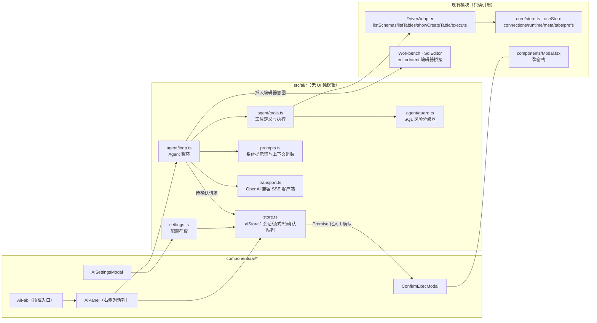

# AI 助手 · 技术实施方案

与主工程严格同构：React 18 + TS + Zustand 4，不引入 AI 框架，Agent 循环自实现（约 300 行内核）。以下所有集成点均为仓库现有代码的真实导出/结构。

---

## 1. 架构总览



**关键决策**

| 决策 | 选择 | 理由 |
| --- | --- | --- |
| 传输层 | 浏览器 `fetch` 直连（SSE 流式） | 主流 OpenAI 兼容端点均放行 CORS；预留 `AiTransport` 接口，未来可加本地桥接代理 |
| Markdown | `marked` + `dompurify` | 成熟、轻（gzip 约 +20KB）；AI 输出必须过 DOMPurify 再 `innerHTML` |
| Agent 框架 | 自实现循环 | 需求仅「工具调用 + 人工确认」，引入框架得不偿失 |
| 状态 | 独立 `aiStore`（zustand） | 与主 store 职责分离；只读引用主 store，绝不反向写 connections/tabs |
| 编辑器写入 | `editorIntent` 事件通道 | Workbench 的 `editorRef` 是组件私有，最小侵入方案见 §6.4 |

## 2. 模块与目录设计

```
src/
├── ai/
│   ├── types.ts            # AiSettings / ChatMsg / ToolCallRecord / RiskLevel / ExecDecision
│   ├── settings.ts         # 配置读写（mws.v1.ai.settings）、默认值、端点预设表
│   ├── transport.ts        # chatStream()：fetch + SSE 解析 + AbortSignal + 错误归一化
│   ├── prompts.ts          # buildSystemPrompt(ctx)：角色、工具规则、输出规范、@表 DDL 注入
│   └── agent/
│       ├── guard.ts        # classifySql(sql) → { level, features[] }（纯函数，可单测）
│       ├── tools.ts        # TOOL_SCHEMAS（OpenAI tools 格式）+ runTool(name, args) → 摘要
│       └── loop.ts         # runAgentTurn()：流式循环 + 工具调度 + 确认队列 + 预算
├── components/ai/
│   ├── AiFab.tsx           # 顶栏入口按钮
│   ├── AiPanel.tsx         # 面板容器 + 消息流 + 输入区（含 / 指令菜单、@ 补全）
│   ├── ChatMessage.tsx     # 四类消息渲染 + SQL 块工具条
│   ├── Markdown.tsx        # marked + DOMPurify 封装（代码块 元数据增强）
│   ├── ConfirmExecModal.tsx# 执行确认弹窗
│   └── AiSettingsModal.tsx # 模型配置弹窗
└── styles/ai.css           # AI 专属样式（仍只用主题变量），由 global.css 尾部 @import
```

对主工程的**全部**改动点（3 处挂载 + 1 处桥接）：

1. `App.tsx`：Topbar 加 `<AiFab />`；`.main` 内 `Workbench` 后加 `<AiPanel />`；全局宿主区加 `<ConfirmExecModal />`（宿主化，同 ModalHost 模式）；
2. `global.css`：`@import './ai.css'`；
3. `index.html`：无改动（无首帧恢复需求，面板开合状态在内存）；
4. `store.ts`：加 `editorIntent` 轻量通道（见 §6.4）。

## 3. 核心数据模型（src/ai/types.ts）

```ts
/* 模型配置 */
export interface AiSettings {
  baseURL: string          // 如 https://api.deepseek.com/v1
  model: string            // 如 deepseek-chat
  apiKey: string           // 仅存本地
  temperature?: number
  maxTokens?: number
  timeoutMs?: number       // 默认 60_000
  autoRunReadOnly: boolean // L0 自动执行，默认 true
  maxToolRounds: number    // 默认 8
  reduceMotion: boolean    // 呼吸/打字机动效开关
}

/* 对话消息（对齐 OpenAI 消息形态，附展示元数据） */
export type ChatRole = 'user' | 'assistant' | 'tool' | 'system'
export interface ChatMsg {
  id: string
  role: ChatRole
  content: string
  toolCalls?: { id: string; name: string; args: string }[]   // assistant 发起的调用
  toolCallId?: string                                        // tool 消息归属
  toolName?: string
  meta?: {
    kind?: 'tool' | 'notice'
    level?: RiskLevel
    error?: boolean
    done?: boolean          // 流式是否结束
  }
}

export type RiskLevel = 0 | 1 | 2 | 3   // 只读 / 数据变更 / 结构变更 / 服务器级
export interface RiskReport { level: RiskLevel; features: string[] }  // features: ['UPDATE 无 WHERE', '多语句', ...]
export type ExecDecision = 'run' | 'deny'
```

## 4. 传输层（transport.ts）

```ts
export interface ChatRequest {
  messages: { role: ChatRole; content: string | null; tool_calls?...; tool_call_id?... }[]
  tools?: OpenAiTool[]           // agent 轮次才携带
  signal: AbortSignal
  onDelta: (text: string) => void
  onToolCalls?: (calls: ToolCall[]) => void
}

export async function chatStream(s: AiSettings, req: ChatRequest): Promise<void>
```

实现要点：

- `POST {baseURL}/chat/completions`，`stream: true`；按行解析 SSE（`data: ` 前缀、`[DONE]` 终止），拼装 `choices[0].delta.content` 与 `delta.tool_calls`（按 index 聚合 `id/name/arguments` 分片）；
- Abort：发送按钮的 ■ 与面板关闭共用一个 `AbortController`；
- **错误归一化**（供 UI 显示与重试）：
  - HTTP 401/403 → 「鉴权失败，请检查 API Key」
  - HTTP 404 → 「接口路径不存在，请检查 baseURL（通常需以 /v1 结尾）」
  - HTTP 429 → 「触发限流，请稍后重试」
  - `TypeError: Failed to fetch` → 「无法连接目标地址（可能被 CORS 拦截或地址不可达），建议用『测试连接』验证」
- 「测试连接」= 同端点 `max_tokens: 1` 的非流式请求，复用同一错误归一化。

## 5. 风险分级器（agent/guard.ts）

纯函数、可单测，**在本地执行、模型不可绕过**：

```ts
export function classifySql(sql: string): RiskReport
```

| 等级 | 判定（取首语句关键字，大小写不敏感） | features 检测 |
| --- | --- | --- |
| L0 只读 | `SELECT` `SHOW` `DESC`/`DESCRIBE` `EXPLAIN` | — |
| L1 数据变更 | `INSERT` `UPDATE` `DELETE` | `UPDATE/DELETE 无 WHERE`（扫描 `where` 关键字）、`INSERT ... ON DUPLICATE KEY` |
| L2 结构变更 | `CREATE` `ALTER` `DROP` `TRUNCATE` `RENAME` | `DROP TABLE/DATABASE` 标注「不可逆（无回收站）」 |
| L3 服务器级 | `GRANT` `REVOKE` `KILL` `SET`（含 GLOBAL/PERSIST）、`SHUTDOWN`、`LOAD DATA`、含 `INTO OUTFILE/DUMPFILE`、`LOAD_FILE(` | 全部命中即列出 |
| 兜底 | 无法解析首关键字 / 多语句（简单分号切分后 > 1 条） | `features: ['多语句', '无法识别的语句类型']`，等级取 3 |

- 注释与字符串先剥离再判定（复用/参照 `core/sql.ts` 的 tokenizer 思路，避免字符串里的 "drop" 误报）；
- `EXPLAIN ANALYZE` 仍按 L0（只读）；`SELECT ... FOR UPDATE` 升级 L1。

## 6. Agent 循环与工具（agent/loop.ts、tools.ts）

### 6.1 循环（伪代码）

```ts
async function runAgentTurn(userMsg: ChatMsg) {
  aiStore.append(userMsg)
  const history = buildHistory()            // system(上下文) + 会话消息（裁剪后）
  for (let round = 0; round < settings.maxToolRounds; round++) {
    const resp = await chatStream(settings, { messages: history, tools: TOOL_SCHEMAS, ... })
    // resp 期间 onDelta 实时写 assistant 消息（流式渲染）
    if (!resp.toolCalls?.length) return     // final answer
    history.push(assistantMsgWith(resp))
    for (const call of resp.toolCalls) {
      if (budget.toolCalls-- <= 0) { /* 回填预算 notice，return */ }
      const result = await runTool(call)    // 见 6.2；含确认等待
      history.push(toolMsg(call.id, result))
      aiStore.append(toolMsg)               // 折叠卡片渲染
    }
  }
  aiStore.append(notice('已达轮次上限，请基于以上信息继续或开新话题'))
}
```

### 6.2 工具执行与确认（tools.ts）

| 工具 | 实现（全部复用现有 Adapter 方法） | 风险 |
| --- | --- | --- |
| `list_schemas` | `adapter.listSchemas()` | L0 直接执行 |
| `list_tables(schema)` | `adapter.listTables(schema)` → 名称/类型/行数/注释摘要 | L0 |
| `describe_table(schema, table)` | `adapter.showCreateTable` + `adapter.getColumns` → DDL + 列注释 | L0 |
| `sample_data(schema, table, n)` | `adapter.execute(SELECT * ... LIMIT min(n,20))` | L0 |
| `run_query(sql, schema?)` | 先 `classifySql` → 策略判定 → `adapter.execute(sql, schema)`；执行前由本地追加/复用 maxRows 语义（SELECT 未带 LIMIT 时提示模型结果已截断） | 按 guard 分级 |

**确认矩阵**（tools.ts 内实现，与 PRD FR-15/16 一一对应）：

| guard 结果 | autoRunReadOnly=true | autoRunReadOnly=false | 会话内已放行相同 SQL |
| --- | --- | --- | --- |
| L0 | 自动执行 | 弹窗确认 | 自动执行 |
| L1 / L2 | 弹窗确认 | 弹窗确认 | 弹窗确认（不放行） |
| L3 / 兜底 | 弹窗确认（无「记住」选项） | 弹窗确认 | 弹窗确认（不放行） |

弹窗经 `aiStore.pendingConfirm` + `ConfirmExecModal` 宿主渲染，`runTool` 以 `Promise<ExecDecision>` 挂起；会话清空/面板关闭/流式中止时所有 pending 一律 resolve('deny')。

### 6.3 工具结果回填（控 token）

- `list_tables`：只回「名称 · 类型 · 注释」行，最多 50 条；
- `describe_table`：回 DDL 全文（单表可控），列注释并入；
- `sample_data` / `run_query`：只回**摘要**——列名 + 行数 + 前 5 行（每格截断 40 字符）+ 截断标记；完整数据只在 UI 折叠卡片里，不进模型；
- 所有 tool 结果以固定前缀包裹：`[工具结果 · 来源：本地数据库]`，响应 Prompt Injection（FR-26）。

### 6.4 编辑器桥接（editorIntent）

Workbench 的 `editorRef` 为组件私有。在 `core/store.ts` 增加：

```ts
editorIntent: { seq: number; type: 'insert' | 'replace'; sql: string } | null
pushEditorIntent(type, sql): void   // Workbench 内 useEffect 订阅 seq 变化，
                                    // 调 editorRef.current 相应方法后清空
```

AI 代码块「插入」= `pushEditorIntent('insert', sql)`；「运行」= 插入成功后调用与手动运行一致的 `Workbench` 执行入口（通过 `useStore` 的 runTab action，结果进结果区页签——AI 不自建结果展示）。

## 7. 提示词（prompts.ts，要点摘录）

System Prompt 骨架（中文）：

- 角色：MySQL 专家助手，运行在 MySQL Web Studio 中；当前上下文：连接名、活动 Schema、表清单（由 buildSystemPrompt 注入，非硬编码）；
- 工具规则：先 `describe_table` 再写 SQL，**禁止编造表/列名**；用户问题涉及时效数据用 `run_query` 而非猜测；
- 输出规范：SQL 一律用 ```sql 代码块、一条语句一块（便于逐块运行）；解释文字放在代码块外；修改类操作必须附回滚思路；结果引用须注明来自工具返回；
- 语言：始终中文回复；
- 用户追加段（FR-04）拼接到末尾。

## 8. 存储设计

| key | 内容 | 裁剪 |
| --- | --- | --- |
| `mws.v1.ai.settings` | AiSettings 全量（含 apiKey，明文本地存储，与项目现有密码存储策略一致并附说明） | — |
| `mws.v1.ai.session` | 会话消息（含 tool 卡片展示数据） | 上限 200 条，超限丢最旧；每条 content 超 8KB 截断 |

读写沿用 `core/storage.ts` 的双模式（localStorage / chrome.storage），AI 模块 import 复用，插件模式天然可用。

## 9. 实施里程碑

### M1 · 对话与生成（P0，先行可交付）

- [ ] `ai/settings.ts` + `AiSettingsModal`（预设、测试连接、错误归一化）
- [ ] `ai/transport.ts`（SSE 流式 + Abort + 重试）
- [ ] `aiStore` 会话状态 + 持久化；`AiFab` + `AiPanel`（消息流、输入区、空态）
- [ ] `Markdown.tsx`（marked + DOMPurify + SQL 块工具条：复制/插入/运行）+ `editorIntent` 桥接
- [ ] `prompts.ts` 上下文注入（连接/Schema/表清单 + `@表` DDL）+ `/` 快捷指令
- 验收：demo 连接下「看看 demo 库有哪些表，写个统计订单的 SQL」可跑通全流程；代码块三键均生效；9 主题无样式破绽。

### M2 · Agent 化（P0/P1）

- [ ] `agent/guard.ts`（分级 + 特征，含单测用例 20+：大小写/注释/字符串干扰/多语句）
- [ ] `agent/tools.ts`（五工具 + 摘要回填）+ `agent/loop.ts`（预算/中止/pending 拒绝）
- [ ] `ConfirmExecModal`（确认矩阵 + 会话内放行）+ 工具折叠卡片
- 验收：demo 库上「找出没有下单的用户」→ 自动查结构 → 生成 SQL →（demo 只读引擎拒绝写操作时）错误回传并给出解释；L1 语句必弹确认。

### M3 · 体验增强（P1/P2）

- [ ] 报错一键求助：结果页签错误态按钮「让 AI 修复」（携带 SQL + 错误信息 + 上下文）
- [ ] 多配置管理（FR-03）与多会话（FR-12）、结果解读（FR-24）、动效开关（FR-25）

## 10. 测试要点

- **guard 单测**：分级矩阵全覆盖 + 注释/字符串干扰样例；
- **transport**：mock SSE 分片（content 与 tool_calls 交错）、[DONE] 前中断、四类错误归一化；
- **loop**：mock 模型返回 tool_calls 序列，验证预算边界、拒绝回填、会话清空时 pending 全拒；
- **联调**：demo 适配器（只读引擎）即可完成端到端联调，无需真实 MySQL；
- **插件模式**：`npm run build:ext` 后在 MV3 中验证 chrome.storage 读取配置与历史。
