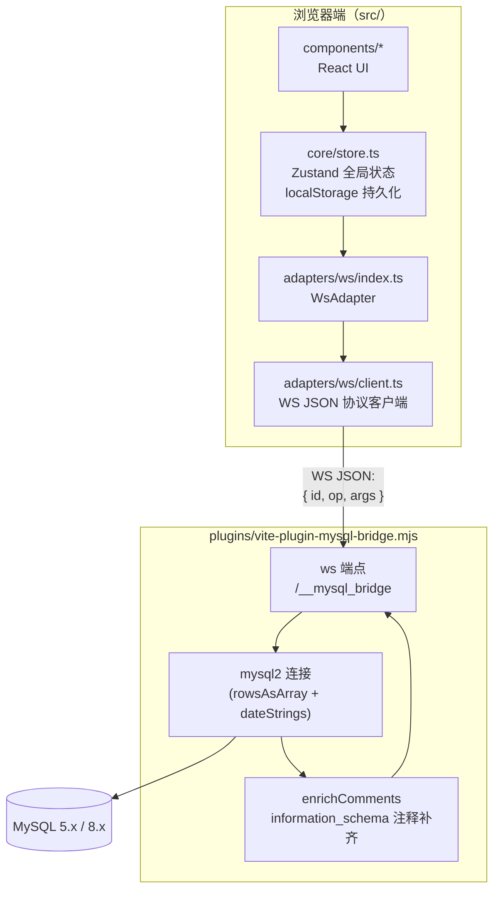

# MySQL Web Studio 架构说明

## 1. 为什么需要桥接器

浏览器安全模型禁止网页直接发起 TCP 连接，而 MySQL 协议（握手、认证插件、包分包）只能跑在 TCP 之上。因此在浏览器与 MySQL 之间需要一个「翻译层」：

```
浏览器（WebSocket） ──► 桥接器（Node.js，mysql2） ──► MySQL（TCP 3306）
```

本项目把这个桥接器做成 **Vite 插件**，直接挂载在 dev server 上——`npm run dev` 一条命令同时启动前端页面与桥接服务，无需独立的 Node 服务。

## 2. 总体架构



## 3. 桥接器实现（`plugins/vite-plugin-mysql-bridge.mjs`）

利用 Vite 插件的 `configureServer(server)` 钩子，在 dev server 的 HTTP server 上监听 `upgrade` 事件，将路径为 `/__mysql_bridge` 的 WebSocket 升级请求交给 `ws` 处理：

- **连接生命周期**：每条 WS 连接对应一个「会话」；`connect` op 时用参数建立 mysql2 连接，`close` op 或 WS 断开时释放
- **执行查询**：`conn.query(sql)`，配置 `rowsAsArray: true`（行数据为二维数组，与前端 `ExecResult.rows: unknown[][]` 对齐）与 `dateStrings: true`（日期按字符串返回，避免时区歧义）
- **字段元数据**：mysql2 返回的 fields 中提取 `name / orgName / orgTable / schema / type / flags`，解析出可空性（`NOT_NULL` flag）与键类型（`PRI_KEY / UNIQUE_KEY / MULTIPLE_KEY` flag）
- **COMMENT 补齐**：mysql2 的字段元数据不含列注释，桥接器用 `f.schema + f.orgTable + f.orgName` 组装 key，批量查询 `information_schema.COLUMNS.COLUMN_COMMENT` 回填；该步骤失败不影响结果返回
- **健壮性**：查询出错时返回 `{ id, ok: false, error }`；连接断开自动清理会话

## 4. WS JSON 协议

### 请求（浏览器 → 桥接器）

```jsonc
// 建立到 MySQL 的连接
{ "id": 1, "op": "connect", "args": { "host": "127.0.0.1", "port": 3306, "user": "root", "password": "***", "database": "app" } }

// 执行 SQL
{ "id": 2, "op": "query", "args": { "sql": "SELECT * FROM users LIMIT 10" } }

// 断开 MySQL 连接
{ "id": 3, "op": "close", "args": {} }
```

### 响应（桥接器 → 浏览器）

```jsonc
// 成功
{ "id": 1, "ok": true,  "data": { "serverVersion": "8.0.36" } }
{ "id": 2, "ok": true,  "data": { "columns": [ { "name": "id", "type": "LONG", "nullable": false, "key": "PRI", "comment": "用户ID" } ], "rows": [[1]], "affected": 0, "insertId": 0 } }

// 失败
{ "id": 2, "ok": false, "error": "ER_NO_SUCH_TABLE: Table 'app.users' doesn't exist" }
```

协议特点：

- **幂等关联**：每条请求带自增 `id`，浏览器端以 Promise 映射等待响应
- **少量 op**：仅 `connect / query / close`，所有能力都通过 SQL 本身表达（如元数据用 `SHOW` / `information_schema` 查询获得）

## 5. 浏览器端结构（`src/`）

```
src/
├── adapters/ws/
│   ├── client.ts    # WebSocket JSON 协议客户端：连接管理、请求-响应 Promise 化
│   └── index.ts     # WsAdapter：实现统一的数据访问接口（connect/execute/showCreateTable/...）
├── components/      # UI 组件
│   ├── Sidebar.tsx        # 左侧树（连接/Schema/表）+ 脚本/历史面板（可收起）
│   ├── Workbench.tsx      # 编辑器工具条、多标签页、运行/格式化/保存
│   ├── ResultsPanel.tsx   # 结果页签（可关闭/清空）、消息页签、结果视图
│   ├── ResultGrid.tsx     # 虚拟化结果表格
│   ├── ModalHost.tsx      # 各类弹窗（连接、导出 SQL、右键触发的表单等）
│   ├── Modal.tsx / SqlModal.tsx  # 弹窗骨架 / SQL 预览弹窗
│   ├── SqlViewer.tsx      # 只读 SQL 查看器（CodeMirror + lang-sql 高亮）
│   └── ContextMenu.tsx    # 通用右键菜单
├── core/
│   ├── store.ts     # Zustand：connections/runtime/meta/tabs/scripts/history/prefs
│   │                #   persist() 按策略写入 localStorage（如未记住密码的连接剔除密码）
│   └── types.ts     # ConnectionConfig / QueryTab / ExecResult / ColumnMeta / UIPrefs
├── lib/             # 工具：SQL 格式化、buildInserts、CSV 序列化、下载等
└── styles/global.css
```

### 关键设计

- **适配器模式**：UI 只依赖统一的数据访问接口（`Adapters`），当前实现为 `WsAdapter`；未来可替换为 HTTP API、PostgreSQL 等其它实现而不动 UI 层
- **持久化策略**（localStorage keys）：

| key | 内容 |
| --- | --- |
| `connections` | 连接配置（未勾选记住密码的连接剔除 `password` 后存储） |
| `tabs` / `activeTabId` | 查询标签页（SQL 内容、活动 Schema、结果集，结果最多保留 12 条） |
| `scripts` | 保存的 SQL 脚本 |
| `history` | 执行历史 |
| `prefs` | 主题、侧栏宽度、结果区高度、maxRows、侧栏面板收起状态等 |

## 6. 二次开发指南

### 新增一个桥接 op（示例）

1. 桥接器 `vite-plugin-mysql-bridge.mjs` 中增加 op 分支：

   ```js
   if (op === 'killQuery') {
     await conn.query(`KILL QUERY ${Number(args.connectionId)}`)
     send(ws, { id, ok: true, data: {} })
     return
   }
   ```

2. `src/adapters/ws/client.ts` 增加类型化方法（发送 `{id, op, args}`，按 `id` 等待响应）
3. `src/adapters/ws/index.ts` 的 WsAdapter 上暴露该能力，供 UI 调用

### 部署为独立桥接服务

生产部署时 dev server 不应暴露公网。若需要远程使用：

1. 将桥接逻辑抽为独立 Node 服务（同样的 `/__mysql_bridge` 协议），**必须加鉴权**（如 WSS + token 校验）
2. 前端在「连接编辑 → 高级选项」中填写独立桥接地址 `wss://...`
3. 前端用 `npm run build` 产出静态文件，任意静态托管即可

### 安全边界提醒

- 协议中 `query` op 会**原样执行任意 SQL**，桥接器不做白名单——这正是「数据库客户端」的语义，但也意味着桥接端口必须只暴露给可信环境
- 密码经 WS 明文传输（`ws://`），本地开发可接受；远程使用请务必启用 `wss://`（TLS）
