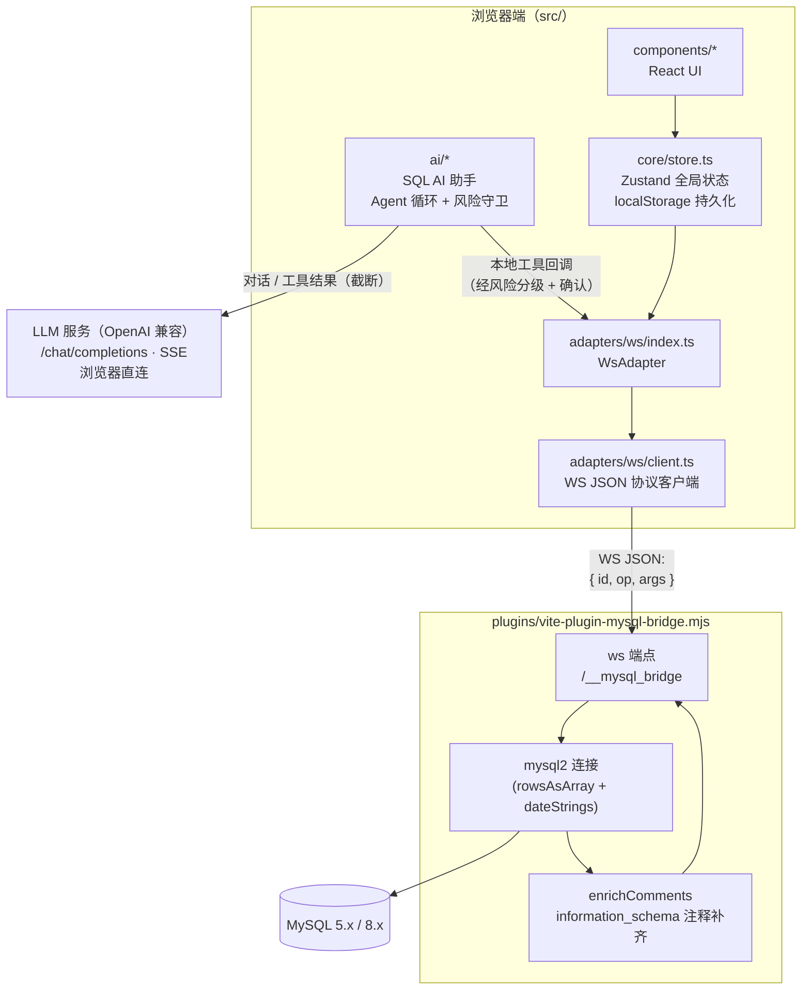

# MySQL Web Studio 架构说明

## 1. 为什么需要桥接器

浏览器安全模型禁止网页直接发起 TCP 连接，而 MySQL 协议（握手、认证插件、包分包）只能跑在 TCP 之上。因此在浏览器与 MySQL 之间需要一个「翻译层」：

```
浏览器（WebSocket） ──► 桥接器（Node.js，mysql2） ──► MySQL（TCP 3306）
```

本项目把这个桥接器做成 **Vite 插件**，直接挂载在 dev server 上——`npm run dev` 一条命令同时启动前端页面与桥接服务，无需独立的 Node 服务。

## 2. 总体架构


```mermaid
flowchart TB
    subgraph FE["浏览器端（src/）"]
        UI["components/*\nReact UI"]
        AI["ai/*\nSQL AI 助手\nAgent 循环 + 风险守卫"]
        ST["core/store.ts\nZustand 全局状态\nlocalStorage 持久化"]
        AD["adapters/ws/index.ts\nWsAdapter"]
        CL["adapters/ws/client.ts\nWS JSON 协议客户端"]
    end

    LLM["LLM 服务（OpenAI 兼容）\n/chat/completions · SSE\n浏览器直连"]

    subgraph PLUGIN["plugins/vite-plugin-mysql-bridge.mjs"]
        WS["ws 端点\n/__mysql_bridge"]
        M2["mysql2 连接\n(rowsAsArray + dateStrings)"]
        EC["enrichComments\ninformation_schema 注释补齐"]
    end

    DB[("MySQL 5.x / 8.x")]

    UI --> ST --> AD --> CL
    AI -- "对话 / 工具结果（截断）" --> LLM
    AI -- "本地工具回调\n（经风险分级 + 确认）" --> AD
    CL -- "WS JSON:\n{ id, op, args }" --> WS
    WS --> M2 --> DB
    M2 --> EC --> WS
```

## 3. 桥接器实现（`plugins/vite-plugin-mysql-bridge.mjs`）

利用 Vite 插件的 `configureServer(server)` 钩子，在 dev server 的 HTTP server 上监听 `upgrade` 事件，将路径为 `/__mysql_bridge` 的 WebSocket 升级请求交给 `ws` 处理：

- **连接生命周期**：每条 WS 连接对应一个「会话」；`connect` op 时用参数建立 mysql2 连接，`close` op 或 WS 断开时释放
- **执行查询**：`conn.query(sql)`，配置 `rowsAsArray: true`（行数据为二维数组，与前端 `ExecResult.rows: unknown[][]` 对齐）与 `dateStrings: true`（日期按字符串返回，避免时区歧义）
- **字段元数据**：mysql2 返回的 fields 中提取 `name / orgName / orgTable / schema / type / flags`，解析出可空性（`NOT_NULL` flag）与键类型（`PRI_KEY / UNIQUE_KEY / MULTIPLE_KEY` flag）
- **COMMENT 补齐**：mysql2 的字段元数据不含列注释，桥接器用 `f.schema + f.orgTable + f.orgName` 组装 key，批量查询 `information_schema.COLUMNS.COLUMN_COMMENT` 回填；该步骤失败不影响结果返回
- **健壮性**：查询出错时返回 `{ id, ok: false, error }`；连接断开自动清理会话

## 4. WS JSON 协议

### 请求（浏览器 → 桥接器）

```jsonc
// 建立到 MySQL 的连接
{ "id": 1, "op": "connect", "args": { "host": "127.0.0.1", "port": 3306, "user": "root", "password": "***", "database": "app" } }

// 执行 SQL
{ "id": 2, "op": "query", "args": { "sql": "SELECT * FROM users LIMIT 10" } }

// 断开 MySQL 连接
{ "id": 3, "op": "close", "args": {} }
```

### 响应（桥接器 → 浏览器）

```jsonc
// 成功
{ "id": 1, "ok": true,  "data": { "serverVersion": "8.0.36" } }
{ "id": 2, "ok": true,  "data": { "columns": [ { "name": "id", "type": "LONG", "nullable": false, "key": "PRI", "comment": "用户ID" } ], "rows": [[1]], "affected": 0, "insertId": 0 } }

// 失败
{ "id": 2, "ok": false, "error": "ER_NO_SUCH_TABLE: Table 'app.users' doesn't exist" }
```

协议特点：

- **幂等关联**：每条请求带自增 `id`，浏览器端以 Promise 映射等待响应
- **少量 op**：仅 `connect / query / close`，所有能力都通过 SQL 本身表达（如元数据用 `SHOW` / `information_schema` 查询获得）

## 5. 浏览器端结构（`src/`）

```
src/
├── adapters/ws/
│   ├── client.ts    # WebSocket JSON 协议客户端：连接管理、请求-响应 Promise 化
│   └── index.ts     # WsAdapter：实现统一的数据访问接口（connect/execute/showCreateTable/...）
├── components/      # UI 组件
│   ├── Sidebar.tsx        # 左侧树（连接/Schema/表，含新建 Schema 入口）+ 脚本/历史面板（可收起）
│   ├── Workbench.tsx      # 编辑器工具条、多标签页、运行/美化/保存
│   ├── ResultsPanel.tsx   # 结果页签（可关闭/清空）、消息页签、结果视图
│   ├── ResultGrid.tsx     # 虚拟化结果表格
│   ├── ModalHost.tsx      # 各类弹窗（连接、导出 SQL、新建 Schema、确认框等）
│   ├── Modal.tsx / SqlModal.tsx  # 弹窗骨架 / SQL 预览弹窗（内置弹窗栈：遮罩层级按打开顺序递增、Esc 只关栈顶，支持弹窗叠加）
│   ├── SqlViewer.tsx      # 只读 SQL 查看器（CodeMirror + lang-sql 高亮）
│   ├── ContextMenu.tsx    # 通用右键菜单（右键/左键点击均可触发，支持色卡等自定义 icon）
│   └── ai/                # AI 助手 UI：AiFab / AiPanel / ChatMessage / AiSettingsModal / ConfirmExecModal 等（见第 6 节）
├── core/
│   ├── store.ts     # Zustand：connections/runtime/meta/tabs/scripts/history/prefs
│   │                #   persist() 按策略写入 localStorage（如未记住密码的连接剔除密码）
│   └── types.ts     # ConnectionConfig / QueryTab / ExecResult / ColumnMeta / UIPrefs / ThemeId + THEMES 主题元数据
├── ai/              # AI 助手核心模块（详见第 6 节）
│   ├── agent/       # guard.ts 风险分级 / tools.ts 五工具 / loop.ts Agent 主循环
│   ├── prompts.ts   # 上下文组装（连接/Schema/表清单、@表名 DDL 附注）
│   ├── settings.ts  # 服务商预设 + 用户设置（ai.settings / ai.profiles）
│   ├── store.ts     # 会话状态与持久化（ai.sessions / ai.session.<id>）
│   └── chat.ts / transport.ts / types.ts   # SSE 客户端 / 传输层 / 类型
├── lib/             # 工具：SQL 格式化、buildInserts、CSV 序列化、下载等
└── styles/global.css  # 全局样式：9 套主题变量组，<html data-theme> 属性选择器切换
```

### 关键设计

- **适配器模式**：UI 只依赖统一的数据访问接口（`Adapters`），当前实现为 `WsAdapter`；未来可替换为 HTTP API、PostgreSQL 等其它实现而不动 UI 层
- **持久化策略**（localStorage keys）：

| key | 内容 |
| --- | --- |
| `connections` | 连接配置（未勾选记住密码的连接剔除 `password` 后存储） |
| `tabs` / `activeTabId` | 查询标签页（SQL 内容、活动 Schema、结果集，结果最多保留 12 条） |
| `scripts` | 保存的 SQL 脚本 |
| `history` | 执行历史 |
| `prefs` | 主题（`ThemeId`，9 选 1）、侧栏宽度、结果区高度、maxRows、侧栏面板收起状态等 |
| `ai.settings` / `ai.profiles` | AI 模型设置与多套模型方案（端点 / 模型 / API Key 等，Key 仅存本机） |
| `ai.sessions` / `ai.session.<id>` / `ai.panelWidth` | AI 会话索引（上限 30）、各会话消息（上限 200 条）与 AI 面板宽度 |

- **多主题机制**：主题差异收敛为每主题一套 CSS 变量组（`src/styles/global.css`），`<html data-theme="...">` 属性选择器匹配生效，`:root` 兜底默认暗色；`public/theme-boot.js` 在首帧渲染前从 localStorage 恢复主题，避免亮色用户刷新时先渲染暗色再切换的闪烁。**新增主题 = global.css 加一组变量 + `types.ts` 的 `THEMES` 注册一行**
- **弹窗栈**：每个 Modal 挂载时入模块级栈，遮罩 `z-index` 按栈序递增（后开的上层）、`Esc` 只关闭栈顶弹窗——支撑「导出弹窗上叠加 SQL 预览，关闭后回到导出弹窗继续操作」等叠加场景

## 6. AI 助手模块（`src/ai/` + `src/components/ai/`）

AI 助手是**浏览器端 Function Calling Agent**：模型服务（OpenAI 兼容 `/chat/completions`，SSE 流式）由浏览器直连，负责理解意图与生成 SQL；**所有数据库操作通过本地工具回调到既有 WS 桥接通道执行**——连接凭据与库数据不出本机，模型只收到工具结果的截断摘要（产品设计详见 `docs/ai/`：PRD / 交互设计 / 技术方案）。

```
src/ai/
├── agent/
│   ├── guard.ts     # SQL 风险分级（L0-L3，纯前端静态判定，模型不可绕过）
│   ├── tools.ts     # 五个工具的 Schema 与实现（回调 WsAdapter）
│   └── loop.ts      # Agent 主循环（SSE 流式渲染、工具轮数预算、中止控制）
├── chat.ts          # /chat/completions 请求与流式解析
├── transport.ts     # fetch SSE 传输层（AbortController）
├── prompts.ts       # 系统提示词组装 / 活动连接上下文 / @表名 DDL 附注
├── settings.ts      # 服务商预设 + 用户设置（ai.settings / ai.profiles）
├── store.ts         # 会话状态与持久化（ai.sessions / ai.session.<id>）
└── types.ts         # AI 模块类型
```

UI 组件在 `src/components/ai/`：AiFab（顶栏入口）、AiPanel（右侧对话面板）、ChatMessage（消息渲染 + SQL 代码块工具条）、AiSettingsModal（模型设置）、ConfirmExecModal（执行确认）、AiSessionHistoryModal（会话历史）。

### 工具集（OpenAI tools 格式）

| 工具 | 作用 | 落地方式 |
| --- | --- | --- |
| `list_schemas` | 列出数据库（Schema） | 元数据缓存 / `SHOW DATABASES` |
| `list_tables` | 列出活动 Schema 的表（上限 50） | 元数据缓存 / `information_schema` |
| `describe_table` | 表结构（DDL + 列信息） | `SHOW CREATE TABLE` |
| `sample_data` | 抽样预览（LIMIT ≤ 20） | `SELECT ... LIMIT` |
| `run_query` | 执行任意 SQL | **经风险分级 + 确认矩阵后**走 `execSql` |

### SQL 风险分级与确认矩阵（`agent/guard.ts`）

`classifySql()` 为本地纯函数：先剥离注释与字符串字面量再判定关键字，提示词无法绕过；分级决定执行策略：

| 级别 | 判定 | 默认行为 |
| --- | --- | --- |
| L0 只读 | SELECT / SHOW / DESC / EXPLAIN / USE / 会话级 SET 等 | `autoRunReadOnly`（默认开）或会话已放行时自动执行；SELECT 自动附加 LIMIT |
| L1 数据变更 | INSERT / UPDATE / DELETE（含无 WHERE 全表变更特征） | 弹 `ConfirmExecModal` 人工确认 |
| L2 结构变更 | CREATE / ALTER / DROP / TRUNCATE / RENAME 等 | 人工确认 |
| L3 服务器级 | GRANT / KILL / LOAD DATA / INTO OUTFILE / SET GLOBAL 等；**多语句兜底**；无法识别兜底 | 人工确认 |

- `SELECT ... FOR UPDATE` 升为 L1；CTE（WITH）按其中最先出现的写操作定级
- 「会话记住放行」仅对 L0 生效；「拒绝执行」会把结果回传模型继续推理

### 上下文注入（`prompts.ts`）

- 每轮实时组装系统提示词：连接名、活动 Schema、表清单（来自 `meta` 缓存）；活动标签页未绑连接时回退第一个在线连接
- 新空会话打开面板时重查 Schema 与表清单（`refreshActiveContext()`），避免面板关闭期间的库表变化导致上下文过期
- 输入 `@表名` 时拉取该表**真实 DDL** 作为附注注入，防止模型编造结构
- 工具结果以 `[工具结果 · 来源：本地数据库]` 前缀回填以隔离不可信内容（防 Prompt Injection）；完整数据仅在本机 UI 展示

### Agent 循环与持久化（`loop.ts` / `store.ts`）

- SSE 流式增量 50ms 节流渲染；工具调用轮数预算 `maxToolRounds`（默认 8）；`AbortController` 支持随时中止；每次请求携带最近 24 条历史
- 持久化 keys 见第 5 节表格（`ai.settings` / `ai.profiles` / `ai.sessions` / `ai.session.<id>` / `ai.panelWidth`）

## 7. 二次开发指南

### 新增一个桥接 op（示例）

1. 桥接器 `vite-plugin-mysql-bridge.mjs` 中增加 op 分支：

   ```js
   if (op === 'killQuery') {
     await conn.query(`KILL QUERY ${Number(args.connectionId)}`)
     send(ws, { id, ok: true, data: {} })
     return
   }
   ```

2. `src/adapters/ws/client.ts` 增加类型化方法（发送 `{id, op, args}`，按 `id` 等待响应）
3. `src/adapters/ws/index.ts` 的 WsAdapter 上暴露该能力，供 UI 调用

### 部署为独立桥接服务

生产部署时 dev server 不应暴露公网。若需要远程使用：

1. 将桥接逻辑抽为独立 Node 服务（同样的 `/__mysql_bridge` 协议），**必须加鉴权**（如 WSS + token 校验）
2. 前端在「连接编辑 → 高级选项」中填写独立桥接地址 `wss://...`
3. 前端用 `npm run build` 产出静态文件，任意静态托管即可

### 安全边界提醒

- 协议中 `query` op 会**原样执行任意 SQL**，桥接器不做白名单——这正是「数据库客户端」的语义，但也意味着桥接端口必须只暴露给可信环境
- 密码经 WS 明文传输（`ws://`），本地开发可接受；远程使用请务必启用 `wss://`（TLS）
- AI 助手的模型 API Key 明文保存在本机 `localStorage`，由浏览器直连模型服务（请使用 HTTPS 端点）；SQL 风险守卫（`guard.ts`）只是前端 AI 交互层的安全网，桥接器仍会原样执行任意 SQL，不能替代桥接器自身的访问控制
