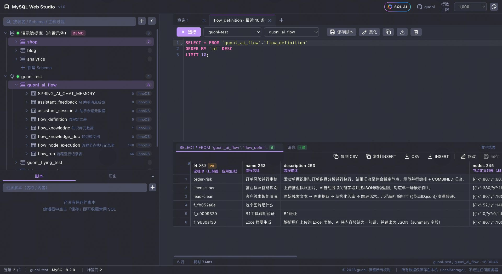
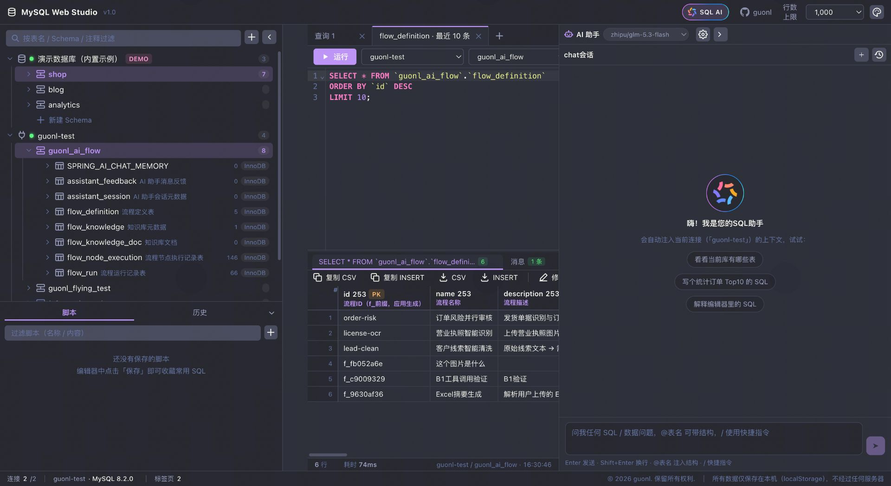
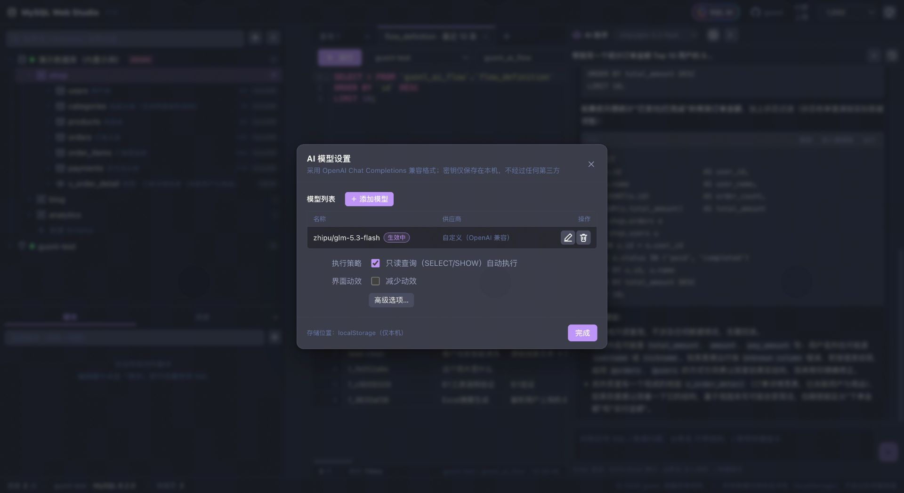
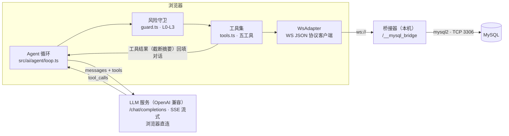
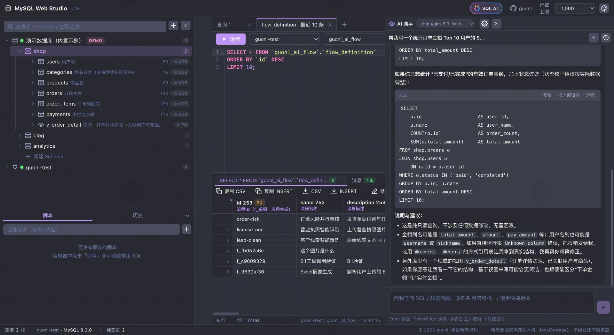
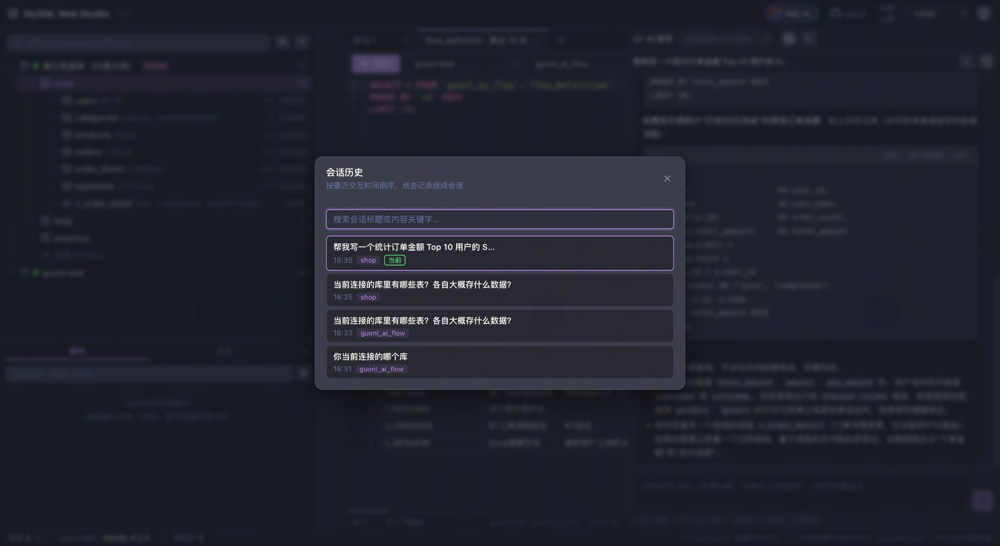

# 一个会自动写SQL的Web Mysql客户端，MySQL Web Studio功能升级，增加AI助手功能

> 开源项目：[guonl-mysql-web-studio](https://github.com/guonl/guonl-mysql-web-studio) · 纯前端 · 浏览器端 Function Calling Agent · 数据不出本机


## 一、先交代背景

在[上一篇《别再为查个数据装 Navicat 了》](why-i-built-mysql-web-studio.md)里，我介绍了 **MySQL Web Studio** 的由来：把 MySQL 客户端整个搬进浏览器标签页——代理层压缩到极限（内嵌 Vite dev server 的 WebSocket 桥接器，只有 `connect / query / close` 三个 op），客户端体验对标桌面软件，Web 与 Chrome 插件双形态，所有数据只存本机。

这一次，功能升级：我给它装上了 AI 助手——**SQL AI**。顶栏一个花瓣 logo 的胶囊按钮，唤起右侧对话面板，你用自然语言说需求，它来查表结构、写 SQL、执行并解读结果。

听起来像市面上无数"ChatBI"、"AI 查数"产品？但作为一个把"数据不出本机"当作底线的纯前端项目，它的实现路线很不一样。这篇文章讲清楚三件事：**架构上怎么做的、AI 的权限怎么管的、以及为什么我敢说"钥匙在你手里"**。

## 二、先看效果：三个真实场景

**场景一：自然语言查库。**「帮我看一下 orders 表里最近一周金额最高的 10 笔订单」——AI 自己列表、看结构、生成 SQL、经确认后执行，再把结果摘要读给你听。



**场景二：`@表名` 精确制导。** 输入 `@` 唤起表名补全，选中表后它的**真实 DDL** 会作为附注注入对话。「orders 关联 users，统计每个用户的下单金额」这类需求，模型不会靠猜列名碰运气。



**场景三：`/fix` 修复报错。** 编辑器里 SQL 执行报错，切到 AI 面板输入 `/fix`——它读取最近一次报错信息和原语句，给出修正版，回复里的 SQL 代码块可以**一键直接运行**，结果落回底部结果区。



斜杠指令一共五个：`/explain` 解释编辑器中的 SQL、`/optimize` 优化、`/tables` 介绍当前 Schema 的表、`/fix` 修复报错、`/clear` 清空会话。

## 三、关键决策：模型不碰数据库，数据库不碰云端

做"AI + 数据库"通常三条路线，我把它们摆在一起看：

| 路线 | 做法 | 问题 |
| --- | --- | --- |
| 数据上云 | 把查询结果导出后发给云端模型分析 | 库数据出内网，对多数企业是安全红线 |
| 服务端 Agent | 部署一个持有数据库连接的 LLM 后端 | 又要部署一套服务，"零部署"的初衷被杀死 |
| **浏览器端 Agent（本方案）** | 模型 API 由浏览器直连；数据库操作以工具形式回调本地桥接器 | 需要浏览器能访问模型服务（HTTPS），可接受 |

我选了第三条，核心原则一句话：**模型只产出 SQL 和决策，永远拿不到数据库连接；库数据只在「本机浏览器 ⇄ 本机桥接器 ⇄ MySQL」之间流动，发给模型的只有表结构与工具结果的截断摘要。**



这也保证了整个项目依然是**纯前端**：AI 引入的全部新东西只有 `src/ai/` 一个前端模块（Agent 循环、工具、风险守卫、上下文组装、会话存储），没有多出任何服务端组件。模型配置里填什么服务商都行——只要是 OpenAI 兼容端点，内置 DeepSeek / OpenAI / Moonshot / 通义千问 / 豆包 / 智谱 / Ollama / 自定义八种预设一键填充，还能保存多套方案随时切换。

## 四、五个工具：数据库操作的最小闭包

Agent 的能力边界由工具决定。我只给了五个，全部按 OpenAI tools 格式定义：

| 工具 | 作用 | 落地方式 |
| --- | --- | --- |
| `list_schemas` | 列出数据库（Schema） | 元数据缓存 / `SHOW DATABASES` |
| `list_tables` | 列出活动 Schema 的表（上限 50） | 元数据缓存 / `information_schema` |
| `describe_table` | 表结构（DDL + 列信息） | `SHOW CREATE TABLE` |
| `sample_data` | 抽样预览（LIMIT ≤ 20） | `SELECT ... LIMIT` |
| `run_query` | 执行任意 SQL | **经风险分级 + 确认矩阵后**走既有 `execSql` |

前四个是"看"，只有 `run_query` 是"做"。工具粒度刻意收窄：模型想了解结构，必须走 `describe_table` 拿**真实 DDL**，而不是凭想象编列名。所有工具最终都回调到与手动执行 SQL 完全相同的 WS 桥接通道——AI 没有任何特权通道。

## 五、AI 不能自己动手改库：风险分级 + 确认矩阵

这是整个设计里我最在意的部分。`run_query` 的每一条 SQL 都会先经过本地风险守卫（`src/ai/agent/guard.ts`）分级：

| 级别 | 判定 | 默认行为 |
| --- | --- | --- |
| L0 只读 | SELECT / SHOW / DESC / EXPLAIN / USE / 会话级 SET 等 | 自动执行（可在设置中关闭），SELECT 自动附加 LIMIT |
| L1 数据变更 | INSERT / UPDATE / DELETE（含无 WHERE 全表变更特征） | 弹窗人工确认 |
| L2 结构变更 | CREATE / ALTER / DROP / TRUNCATE / RENAME 等 | 人工确认 |
| L3 服务器级 | GRANT / KILL / LOAD DATA / INTO OUTFILE / SET GLOBAL 等；**多语句兜底**；无法识别兜底 | 人工确认 |

几个设计细节值得展开：

- **模型无法绕过分级**。`classifySql()` 是纯前端静态判定：先把注释和字符串字面量剥掉，再看关键字。模型说一百遍"我保证这是只读"也没用——它根本不参与分级。`SELECT ... FOR UPDATE` 自动升为 L1；CTE（WITH）按其中最先出现的写操作定级。
- **兜底哲学是"宁可多确认一次"**。多语句、无法识别的语句一律按最高警戒 L3 处理，而不是放行。
- **「本次会话记住放行」只对 L0 开放**。你可以让本会话的只读查询免确认，但数据/结构变更每次都要亲手点。
- **拒绝也是一种反馈**。点「拒绝执行」会把结果回传给模型，它会换方案——比如把"直接删掉脏数据"改成"先 SELECT 出来给你看"。



## 六、防编造与防注入：上下文注入的两道工事

LLM 查库的两大经典翻车点：编造表结构、被数据里的恶意指令劫持。对应两道工事：

1. **上下文每轮实时组装**：系统提示词里注入当前连接名、活动 Schema、表清单（来自元数据缓存）。新开空会话时还会自动重查一遍 Schema 与表清单——面板关着的时候库表可能已经变了；活动标签页没绑连接时，回退到第一个在线连接，避免"AI 以为没连接"。
2. **`@表名` 拉真实 DDL 附注**：用户显式点名哪张表，就把该表 `SHOW CREATE TABLE` 的真实结构注入对话，附注明确标记来源——模型不猜结构。
3. **工具结果加来源前缀回填**：回传给模型的内容统一带上 `[工具结果 · 来源：本地数据库]` 前缀，隔离不可信内容——即便表注释里藏了"忽略以上指令"之类的 Prompt Injection，也会被当作数据而非指令处理。完整查询结果只在本机 UI 展示，模型只收到截断摘要。

## 七、工程细节：一个能用的 Agent 循环长什么样

玩具 demo 和日常工具的差距全在细节里：

- **SSE 流式渲染**，增量 50ms 节流，不刷爆 React 渲染；
- **工具轮数预算** `maxToolRounds`（默认 8），防止模型陷入无限自我修正的循环烧 token；
- **随时可中止**：AbortController 贯穿请求与循环，回复中点一下停止按钮立刻生效；
- **历史窗口**：每次请求带最近 24 条消息，平衡上下文完整性与 token 成本；
- **会话本机持久化**：上限 30 个会话、每会话 200 条消息；新会话默认标题「chat会话」，发出首句话后自动重命名，空会话不占历史；
- **SQL 代码块工具条**：AI 回复里的每个 SQL 都可以复制 / 插入编辑器精修 / 直接运行——"直接运行"走的是你自己的确认体系，结果进底部结果区，AI 还能继续解读。

## 八、必须说清楚的安全边界（仍然丑话在前）

- **API Key 明文存在本机浏览器存储中**，且由浏览器直连模型服务——请使用 HTTPS 端点，不要把 Key 填进不可信的中间代理；
- **风险守卫在前端**，而桥接器仍会原样执行任意 SQL——守卫是 AI 交互层的安全网，**不能替代**桥接器自身的访问控制（本项目依然只建议本地 / 内网使用）；
- **发给模型的内容**包括：表结构、DDL、你输入的问题、截断后的查询结果摘要。请确认你的模型服务商条款允许传输这些内容；生产敏感库请自行评估。

工具的边界坦诚标注，才能放心使用。

## 九、如何体验

```bash
git clone https://github.com/guonl/guonl-mysql-web-studio.git
cd guonl-mysql-web-studio
npm install
npm run dev
```

打开 <http://localhost:5188>，三步用上 AI：

1. 点顶栏「**SQL AI**」按钮打开面板；
2. 面板头部「模型设置」里填 **API 地址 / 模型名称 / API Key** 三要素（可从预设服务商一键填充，支持 Ollama 本地模型）；
3. 开聊——或者先连内置演示库试手感，连真实库也一样。



Chrome 插件模式下 AI 助手同样可用，配置与对话一样只存本机。

## 十、写在最后

上一篇说，MySQL Web Studio 瞄准的是"被忽略的大多数场景"：临时查个数、写个验证 SQL、看看表结构。这一次，AI 把"写 SQL"这道门槛也抹掉了——业务同学用自然语言就能查数，开发者让 AI 起草再精修。

但和整个项目的设计哲学一致：**便利可以交给模型，控制权必须留在你手里。** 数据不出本机、变更必经确认、分级无法绕过——AI 是加了辅助驾驶，方向盘仍然在你手上。

项目完全开源，欢迎 Star、提 Issue、提 PR：

- 源码地址：**https://github.com/guonl/guonl-mysql-web-studio**
- 技术栈：React 18 / TypeScript / Zustand 4 / CodeMirror 6 / Vite 5 / mysql2
- 更多文档：[使用手册 · AI 助手](../usage.md) · [架构说明 · AI 模块](../architecture.md) · [AI 助手规划](../ai/README.md)

如果它帮你省掉了一次装软件的折腾、一次写 SQL 的抓瞎，欢迎把它转发给你的同事——这就是对我最好的支持。

---

*作者：guonl · Copyright (c) 2026*
