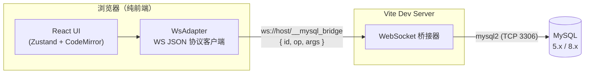

# 别再为查个数据装 Navicat 了：我把 MySQL 客户端搬进了浏览器标签页

> 开源项目：[guonl-mysql-web-studio](https://github.com/guonl/guonl-mysql-web-studio) · 纯前端 · 双形态（Web / Chrome 插件） · 一条命令启动


## 一、当下的现状：我们查个数据到底有多麻烦？

先问几个扎心的问题：

- 你有没有只是想**看一眼线上某张表的数据**，却要在跳板机上折腾半天 SSH 隧道？
- 你有没有遇到过**公司安全策略禁止在办公电脑安装任何软件**，而手里正好没有 Web 化的数据库工具？
- 你有没有被 Navicat 的**付费弹窗**、DBeaver 的 **JVM 启动进度条**、DataGrip 的**几个 G 内存占用**劝退过？
- 你有没有在**别人的电脑 / 临时环境 / 客户现场**，急着想执行一条 SQL，却发现什么工具都没有？

这就是大多数开发者和 DBA 的日常现状。市面上的工具大致分三类，各有各的痛：

| 工具类型 | 代表 | 痛点 |
| --- | --- | --- |
| 桌面客户端 | Navicat / DataGrip / DBeaver | 体积大、要安装、收费或吃内存、内网机器装不了 |
| 传统 Web 工具 | phpMyAdmin / Adminer | 需要部署 PHP 环境、界面停留在十年前、体验粗糙 |
| 云厂商控制台 | 各云 DMS | 绑定自家云、要开权限审批、临时库不方便接入 |

**核心矛盾是**：查数据是一个高频、轻量、临时的动作，但现有工具全都是"重量级"的——要么重装一套环境，要么走一遍审批流程。工具的重量和任务的重量严重不匹配。

## 二、为什么我创造了这个产品

我想要的其实很简单：**打开一个浏览器标签页，输入连接信息，就能像桌面客户端一样浏览库表、写 SQL、导数据。关掉标签页，不留痕迹。**

但这里有一个绕不开的技术问题：**浏览器的安全模型不允许网页直接发起 TCP 连接**。WebSocket？它跑在 HTTP 升级之上，MySQL 协议并不认。这意味着"纯浏览器直连 MySQL"在物理上就是不存在的，任何号称纯前端的数据库客户端，背后都必然有一个代理层。

市面上常见做法是让你独立部署一个后端服务（比如 CloudBeaver），部署成本又把"轻量"这个初衷杀死了。

于是我做了一个设计取舍——**把代理层做到最小、最透明**：

- 它不是独立服务，而是**内嵌在 Vite dev server 里的一个 WebSocket 桥接器**（基于 Node 生态最成熟的 `mysql2` 驱动）；
- 协议被压缩到极致，只有 **3 个 op**：`connect` / `query` / `close`；
- 启动方式只有一条命令：`npm run dev`，桥接器随 dev server 自动拉起，**零配置**。



这就是 **MySQL Web Studio** 的由来：一个把"代理层"压缩到极限、把"客户端体验"对标桌面软件的**纯前端 MySQL 客户端**。

## 三、它有什么优点

### 1. 双形态：Web 开箱即用，也能装进 Chrome

- **Web 模式**：`npm run dev` 一条命令，打开浏览器就能用；
- **Chrome 插件模式（MV3）**：`npm run build:ext` 打包后加载进 Chrome，从此数据库工具就在你的浏览器工具栏里，**点图标即开**，数据存 `chrome.storage.local`。

插件形态的意义在于：浏览器是唯一一个"企业电脑普遍允许安装"的软件。装不了 Navicat 的机器，几乎都能装 Chrome 扩展。

### 2. 体验对标桌面客户端，不是玩具

这不是一个"能跑 SQL 就行"的 demo，常用功能全部到位：

- **连接管理**：多连接、自定义命名、可选记住密码；
- **库表浏览**：连接 → Schema → 表/视图 三级树，表名/注释过滤（Schema 手风琴式交互，过滤只作用于当前展开的库，不会被同名表干扰），行数估算、引擎类型一目了然；
- **右键菜单**：复制名称、查看 DDL（弹窗大小可拖拽调节）、查看最近 10 条记录、前 100 行、导出；
- **SQL 编辑**：CodeMirror 6，语法高亮 + 智能补全（**连字段 COMMENT 都能补全提示**）、多查询标签页、运行选中语句、一键格式化；
- **结果面板**：表头显示字段名、类型、主键徽标和 **COMMENT 描述**；长字段（JSON/TEXT）自动截断 100 字符，悬停看全值，不再被超宽字段毁掉整个表格；结果区高度可拖拽；
- **SQL 脚本 & 执行历史**：本地持久化，随时回填重跑；
- **导出**：DDL / INSERT 语句（支持 `DROP TABLE`、`IF NOT EXISTS`、`INSERT IGNORE`、SQL 预览）、CSV 导出；
- **暗 / 亮双主题**，界面细节全部打磨过。


### 3. 隐私优先：数据只在你本机

- 连接配置、SQL 脚本、执行历史**全部保存在本机**（Web 模式 `localStorage`，插件模式 `chrome.storage.local`），**不经过任何第三方服务器**；
- 桥接器就跑在你自己的机器上，MySQL 流量不出你的内网。

对于安全敏感的企业环境，这一点比任何功能都重要。

### 4. 架构极简，二次开发友好

前端 React 18 + TypeScript（strict）+ Zustand 4 + CodeMirror 6，代码结构清晰（`adapters/` 协议适配、`components/` UI、`core/` 状态与存储）。桥接器核心抽离在 `bridge/bridge-core.mjs`，Web 模式和插件模式两个入口共用。想改成 PostgreSQL？只要桥接器换驱动、协议加个 op 的事。

### 5. 内置演示库，30 秒上手

不配置任何 MySQL，项目内置了一个 demo 数据库（示例电商库 `shop`），打开页面自动连接。**你可以先体验，再决定要不要接入真实库。**

## 四、如何使用

### 方式一：Web 模式（推荐先体验这个）

环境要求：Node.js ≥ 18

```bash
git clone https://github.com/guonl/guonl-mysql-web-studio.git
cd guonl-mysql-web-studio
npm install
npm run dev
```

打开 <http://localhost:5188>，会自动连上内置演示库。点击左上角「+ 新建连接」，填入你的 MySQL 主机、端口、用户名、密码，开始使用。桥接器内嵌在 dev server 里，**无需任何额外配置**。

### 方式二：Chrome 插件模式

```bash
npm run build:ext   # 构建插件产物到 dist/
npm run bridge      # 另开终端，启动独立桥接器（默认端口 5189）
```

然后：Chrome 打开 `chrome://extensions` → 开启「开发者模式」→「加载已解压的扩展程序」→ 选择 `dist/` 目录。之后点击工具栏图标即可随时唤起。


### 三分钟上手路线

1. **连库**：新建连接（或直接玩内置 demo 库）；
2. **浏览**：左侧树展开 Schema，右键任意表看 DDL / 预览数据；
3. **写 SQL**：新建查询标签页，试试表名补全和字段 COMMENT 提示；
4. **导出**：右键表 → 导出 SQL，勾选选项后预览或直接下载；
5. **沉淀**：常用 SQL 存为脚本，执行历史自动帮你记着。

## 五、必须说清楚的安全边界

作为一款工程工具，我把丑话写在前面：

- 本项目定位为**本地 / 内网开发工具**，**不要**把 dev server 或桥接端口暴露到公网（桥接器无鉴权）；
- 勾选「记住密码」后密码明文存在本机存储中，介意可不勾选（仅会话内有效）；
- 构建产物是纯静态前端，部署到 Web 或打包插件后，均需自行运行桥接器（`npm run bridge`）；公网场景请自行加鉴权并使用 `wss://`。

工具的边界坦诚标注，才能放心使用。

## 六、写在最后

MySQL Web Studio 不是要取代 Navicat 或 DataGrip——重度数据库作业（ER 图设计、数据同步、备份恢复）它们依然是王者。它瞄准的是那个**被忽略的大多数场景**：临时查个数、写个验证 SQL、看看表结构、导一份小数据。

这些场景下，你要的不是一个几个 G 的软件，而是一个**浏览器标签页**。

项目完全开源，欢迎 Star、提 Issue、提 PR：

- 源码地址：**https://github.com/guonl/guonl-mysql-web-studio**
- 技术栈：React 18 / TypeScript / Zustand 4 / CodeMirror 6 / Vite 5 / mysql2
- 更多文档：[使用手册](../usage.md) · [架构说明](../architecture.md)

如果它帮你省掉了一次装软件的折腾、一次审批的等待，欢迎把它转发给你的同事——这就是对我最好的支持。

---

*作者：guonl · Copyright (c) 2026*
